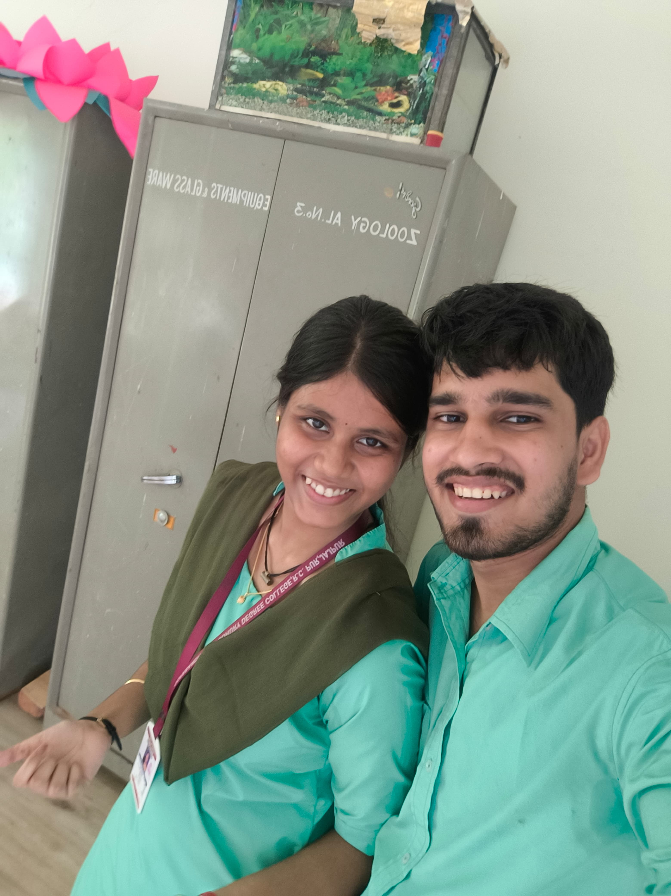
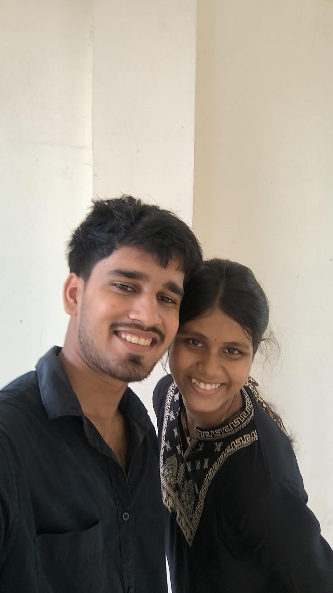

<!DOCTYPE html>
<html lang="en">
<head>
<meta charset="UTF-8">
<meta name="viewport" content="width=device-width, initial-scale=1.0">
<meta name="theme-color" content="#fff0f6">
<meta name="description" content="A little birthday universe made with love for Anuska, my Kyuutu.">
<title>Kyuutuverse ♡ | Anuska's Birthday</title>

</head>

<body>

<nav>
  ♡ Kyuutuverse
  <a href="#home">Home</a>
  <a href="#memories">Memories</a>
  <a href="#song">Our Song</a>
  <a href="#videos">Videos</a>
  <a href="#games">Games</a>
  <a href="#letter">Letter</a>
  <a href="#wishes">Wishes</a>
  <a href="#surprise">Surprise</a>
</nav>

<header class="hero" id="home">
  

    A tiny universe made for one special girl
    
💗

    
For my favourite person

    <h1>Kyuutuverse</h1>
    <h2 style="font-size:clamp(1.25rem,5vw,2rem)">Happy Birthday, Anuska! 🎂</h2>
    

      Welcome to your own little corner of the internet, Kyuutu.
      Filled with memories, music, silly games, warm wishes and
      all the little things that remind me of you. 🎀✨
    

    <!-- MUSIC IS ABOVE THE COUNTDOWN -->
    

      
Our little soundtrack

      
🎵

      <h3 style="margin-bottom:4px">Tera Naam Doon</h3>
      
A song for my Kyuutu 💗

      

        
      

      <audio id="ourSong" controls preload="metadata">
        <source src="tera naam doon.mp3" type="audio/mpeg">
        Your browser does not support audio playback.
      </audio>
      
Press play and let the music make this moment special. 🎧

      <button class="btn secondary" id="songDedication">Song dedication 💌</button>
    

    
The birthday countdown

    

      
<strong id="days">--</strong>DAYS

      
<strong id="hours">--</strong>HOURS

      
<strong id="minutes">--</strong>MINUTES

      
<strong id="seconds">--</strong>SECONDS

    

    
Counting down to your special day 💕

    <a href="#universe" class="btn">Enter your universe ✨</a>
    <button class="btn secondary" id="reminderButton">A little reminder 💌</button>
  

</header>

<section id="universe">
  

    

      
Choose your adventure

      <h2>Your little universe 🌷</h2>
      
Every corner holds a different little surprise. Explore wherever your heart takes you.

    

    

      <a class="portal" href="#memories">📸<strong>Our Memory Lane</strong>Little moments, forever saved.</a>
      <a class="portal" href="#song">🎧<strong>Our Song</strong>Press play and stay a while.</a>
      <a class="portal" href="#videos">🎬<strong>Moving Memories</strong>Three little video moments.</a>
      <a class="portal" href="#games">🎮<strong>Kyuutu Games</strong>Tiny challenges and cute rewards.</a>
      <a class="portal" href="#letter">💌<strong>Open When Ready</strong>A letter written just for you.</a>
      <a class="portal" href="#wishes">🌠<strong>Wish Galaxy</strong>Make a wish for your new year.</a>
    

  

</section>

<section id="memories">
  

    

      
Little pieces of forever

      <h2>Our Memory Lane 📸</h2>
      
Three pictures, three little reminders that ordinary moments can feel special.

    

    

      

        
        
MEMORY 01 One for the memory book 💗

      

      

        
        
MEMORY 02 A moment worth keeping 🌷

      

      

        
        
MEMORY 03 Saved with a little love 🎀

      

    

    
Tap any picture to view it larger. Make sure the filenames match your repository exactly.

  

</section>

<section id="videos">
  

    

      
Little moments in motion

      <h2>Our Mini Cinema 🎬</h2>
      
Press play whenever you want to revisit these moments.

    

    

      

        VIDEO 01
        <h3>Memory in Motion 🌸</h3>
        <video class="media" controls preload="metadata" playsinline>
          <source src="VIDEO1.mp4" type="video/mp4">
          Your browser does not support video.
        </video>
      

      

        VIDEO 02
        <h3>Cutiepie 🎀</h3>
        <video class="media" controls preload="metadata" playsinline>
          <source src="VIDEO2.mp4" type="video/mp4">
          Your browser does not support video.
        </video>
      

      

        VIDEO 03
        <h3>Hihihi 💗</h3>
        <video class="media" controls preload="metadata" playsinline>
          <source src="VIDEO3.mp4" type="video/mp4">
          Your browser does not support video.
        </video>
      

    

  

</section>

<section id="games">
  

    

      
Play a little

      <h2>Kyuutu's Fun Corner 🎮</h2>
      
Little games made to bring a smile to your face.

    

    

      

        <h3>1. Catch the Hearts 💗</h3>
        
Tap the button to collect five hearts.

        

        
Hearts collected: 0 / 5

        <button class="btn" id="heartButton">Collect a heart 💗</button>
        

      

      

        <h3>2. Guess the Nickname 🎀</h3>
        
What cute nickname is used on this website?

        <input id="nicknameInput" placeholder="Type your answer..." autocomplete="off">
        <button class="btn" id="nicknameButton">Check answer</button>
        

      

      

        <h3>3. Pick a Mystery Gift 🎁</h3>
        
Choose one box to reveal a little message.

        

          <button class="gift" data-gift="0" aria-label="Gift one">🎁</button>
          <button class="gift" data-gift="1" aria-label="Gift two">🎀</button>
          <button class="gift" data-gift="2" aria-label="Gift three">💝</button>
        

        

      

      

        <h3>4. Daily Compliment 🌷</h3>
        
Tap for a small reminder of how special you are.

        
🌸

        <button class="btn" id="complimentButton">Give me a compliment</button>
        

      

    

  

</section>

<section id="letter">
  

    

      
A few words from my heart

      <h2>Dear Anuska 💌</h2>
      
A little letter for you to read whenever you need a smile.

    

    

      
Dear Kyuutu,

Happy Birthday, Anuska! 🎂💗

Today is a reminder of how wonderful it is to have someone who can make an ordinary day feel a little more special.

I hope this new chapter brings you peaceful mornings, beautiful opportunities, genuine laughter and people who treat your heart with kindness.

Never forget that you deserve to feel appreciated, supported and happy. Keep being yourself, keep dreaming big, and keep finding little reasons to smile.

May your favourite songs sound sweeter, your dreams feel closer, and your days be filled with lovely surprises.

This little website is a collection of moments, music and words, made especially for you. I hope it makes you smile whenever you visit it.

Happy Birthday once again, my Kyuutu. 🎀

With lots of good wishes,
Biraja 💗

      

        <button class="btn" id="letterLoveButton">Send a little love 💖</button>
      

    

  

</section>

<section id="wishes">
  

    

      
A sky full of possibilities

      <h2>Wish Upon a Star 🌠</h2>
      
Think of something you hope for in your new year, then release your wish into the galaxy.

    

    

      
🌌✨🌙

      <textarea id="wishInput" rows="3" placeholder="Write your birthday wish here..."></textarea>
      <button class="btn" id="wishButton">Release my wish ✨</button>
      

      
Your wish stays in this page while it is open. It isn't sent anywhere.

    

  

</section>

<section id="timecapsule">
  

    

      
A note for another day

      <h2>Future You's Time Capsule ⏳</h2>
      
Write a little message to your future self.

    

    

      <label for="futureNote"><strong>Dear future Anuska...</strong></label>
      <textarea id="futureNote" rows="4" placeholder="What do you want to remember? What are you dreaming about?"></textarea>
      <button class="btn" id="saveNoteButton">Save my time capsule 💌</button>
      <button class="btn secondary" id="loadNoteButton">Read saved note</button>
      

      
The note is saved in this browser on this device. It may not appear on another phone or browser.

    

  

</section>

<section id="surprise">
  

    

      
One last little thing

      <h2>The Birthday Surprise 🎂</h2>
      
Take a breath, make a wish, and open your final surprise.

    

    

      
🎂

      <h3 id="surpriseTitle">Ready for your surprise, Kyuutu?</h3>
      
This little universe was made to celebrate you and the happiness you deserve.

      <button class="btn" id="finalButton">Open the surprise ✨</button>
      

    

  

</section>

<section id="last">
  

    
🌷💗🎀

    <h2>End of the page, not the good wishes.</h2>
    
Whenever you return, may this little corner bring back a happy thought.

    <button class="btn secondary" id="topButton">Back to the beginning ↑</button>
  

</section>

<footer>
  
Made with 💗 by Biraja, especially for Anuska.

  
Kyuutuverse © 2026 · A tiny universe of memories ✨

</footer>

</body>
</html>
